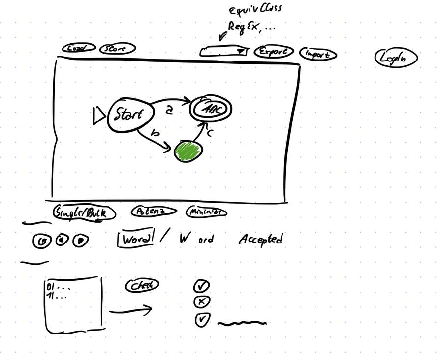

# Title

<General Info>

## Goals/TODO

### General

- [ ] link old editor https://neuralcoder3.github.io/
- [ ] redirect from https://neuralcoder3.github.io/

### Automata Editor

The editor should be intuitive and easy to use.
- [x] Add a new node
- [x] named nodes
- [x] have a unique start node
- [x] multiple edges between nodes (or separated labels)
- [x] named labels
- [x] custom nodes
- [x] mark nodes as final (double border)
  - [ ] good looking double outline
- [x] select nodes, edges
- [x] move nodes
- [x] add edges
- [x] delete nodes, edges
- [ ] save/load automata
- [x] extract simple datastructure
- [x] zoom
- [x] pan

### Export Formats

- [ ] Graphviz
- [x] LaTeX (Tikz)
- [x] JSON
- [x] Text (5-Tuple)
- [x] Url
- [ ] Image
- [ ] SVG
- [ ] Table (for Turing)
- [ ] RegEx
- [ ] Grammar

### Memory

- [ ] Save to perma link
- [ ] Save to local storage
- [ ] Save to file
- [ ] Save to server
- [ ] Import from all

### Simulation

- [x] Step through automata (highlight current node and position in word)
- [x] Word input
- [x] list of words (marked intended rejections) => bulk judge
- [x] NFA simulation
- [ ] Turing simulation

### Special Features

- [ ] Regex to automata
- [ ] Automata to regex
- [x] Minize automata
- [x] NFA to DFA (power automaton)
- [ ] Check equivalence (as import)
- [ ] compute equivalence classes (myhill- [ ]nerode) (as export)
- [x] Regex labels

### Bugs/Tests

- [ ] Check for power automaton (epsilons)
- [ ] Check for regex labels

### Preview

## Technical

To install the packages, you might need to use `npm i --legacy-peer-deps`.

The theory is abstracted in `src/GraphUtils.tsx` and `src/interfaces.tsx`.

